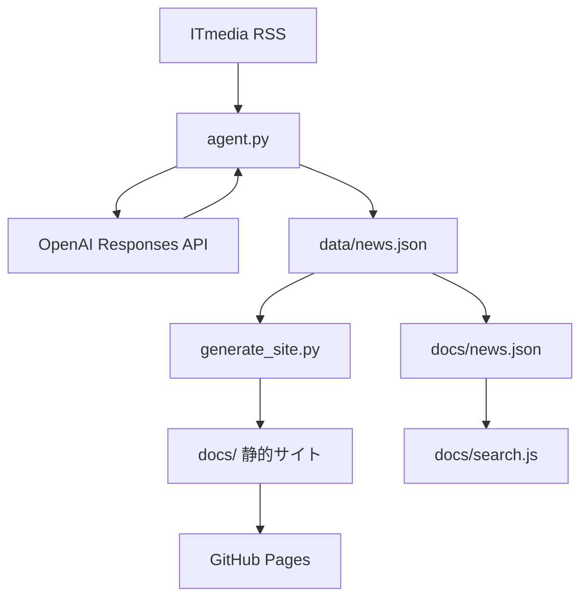
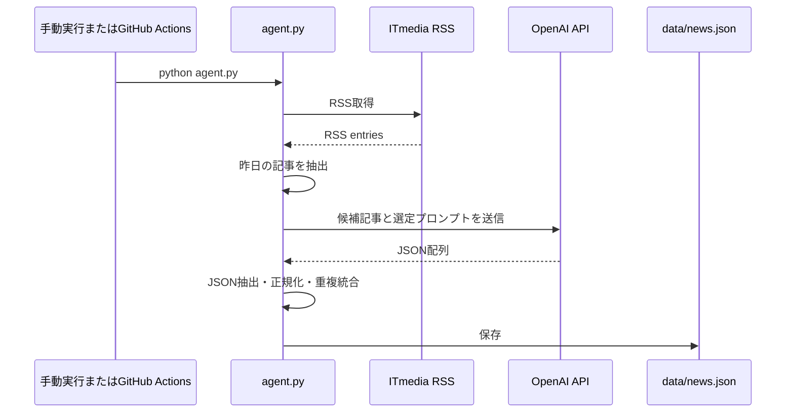
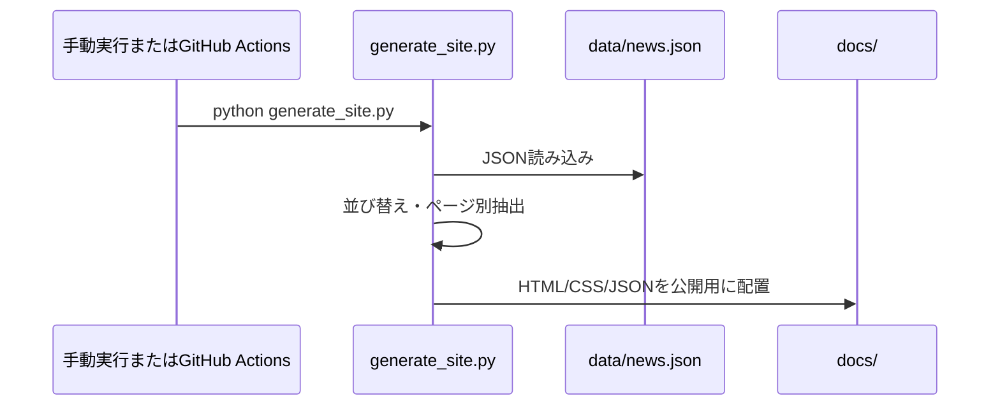

# システム設計書

## 1. システム概要

Tech Compass 505 は、ITmedia のRSSからITニュースを取得し、OpenAI APIで重要なニュースを選定・要約したうえで、GitHub Pagesで公開できる静的HTMLサイトを生成するアプリケーションです。

主な目的は、日々のITニュースから重要度の高い記事を短時間で把握できるようにすることです。

## 2. システム構成

## 3. 主要コンポーネント

### 3.1 `agent.py`

ニュース収集とAI選定を担当します。

主な処理:

1. `https://rss.itmedia.co.jp/rss/2.0/news_bursts.xml` からRSSを取得する。
2. JST基準で「昨日公開された記事」を候補にする。
3. 昨日の記事がRSS内に残っていない場合、RSS最新10件を候補にする。
4. OpenAI APIへ候補記事を渡し、最大5件の重要ニュースを選定・要約する。
5. 選定結果を正規化し、`data/news.json` に保存する。
6. URLをキーに既存ニュースを更新または新規追加する。
7. 重要度に応じた保持期間を過ぎたニュースを整理する。

### 3.2 `generate_site.py`

`data/news.json` を読み込み、GitHub Pages向けの静的ファイルを生成します。

生成対象:

- `docs/index.html`
- `docs/news/index.html`
- `docs/ai/index.html`
- `docs/search/index.html`
- `docs/news.json`

主な処理:

1. `data/news.json` を読み込む。
2. 公開日時、重要度、保存日時の降順でニュースを並べる。
3. トップ、ニュース一覧、AIニュース、検索ページを生成する。
4. 検索ページ用に `docs/news.json` も公開する。

### 3.3 `docs/search.js`

検索ページのクライアントサイド検索を担当します。

検索条件:

- キーワード
- カテゴリ
- 重要度の下限
- 開始日
- 終了日

検索対象:

- タイトル
- 要約
- 選定理由
- カテゴリ

検索条件はURLクエリにも反映されます。

### 3.4 `docs/style.css`

静的サイト全体のスタイルを担当します。

主なUI要素:

- ヘッダー
- グローバルナビゲーション
- 検索フォーム
- ニュースカード
- カテゴリバッジ
- 重要度バッジ
- レスポンシブレイアウト

### 3.5 `app.py`

MySQLに保存されたニュースをFlaskで一覧表示するローカル確認用アプリです。

現行のGitHub Pages公開経路では使用しません。

### 3.6 `agent_mysql.py`

RSS取得、OpenAI APIによる選定、MySQL保存を行う旧方式のエージェントです。

現行の主経路は `agent.py` と `data/news.json` です。

## 4. 処理フロー

### 4.1 ニュース更新フロー

### 4.2 静的サイト生成フロー

## 5. 画面仕様

### 5.1 トップページ `docs/index.html`

表示内容:

- 昨日のニュース
  - JST基準の「前日」に公開されたニュースを最大5件表示する。
- 直近の重要ニュース
  - 重要度4以上のニュースを最大5件表示する。

### 5.2 ニュース一覧 `docs/news/index.html`

表示内容:

- 保存中の全ニュース
- 公開日時、重要度、保存日時の降順

### 5.3 AIニュース `docs/ai/index.html`

表示内容:

- カテゴリが `AI` のニュースのみ
- 並び順はニュース一覧と同じ

### 5.4 検索ページ `docs/search/index.html`

表示内容:

- キーワード入力
- カテゴリ選択
- 重要度下限
- 開始日
- 終了日
- 検索結果件数
- 検索結果カード

検索はブラウザ上で完結し、サーバーサイド処理はありません。

## 6. ニュースカード表示項目

各ニュースカードは次の項目を表示します。

- カテゴリ
- 公開日時
- 重要度
- タイトル
- 要約
- 選定理由
- 記事リンク
- 保存日時

## 7. 外部サービス

### 7.1 ITmedia RSS

ニュース候補の取得元です。

- URL: `https://rss.itmedia.co.jp/rss/2.0/news_bursts.xml`

### 7.2 OpenAI API

ニュース選定、要約、重要度判定、カテゴリ分類に使用します。

利用箇所:

- `agent.py`
- `agent_mysql.py`

モデル:

- 環境変数 `OPENAI_MODEL` がある場合はその値
- 未設定時は `gpt-5-mini`

## 8. セキュリティ方針

- APIキーは `.env` またはGitHub Secretsで管理する。
- `OPENAI_API_KEY` をHTML、JavaScript、JSONに出力しない。
- 静的サイトは `docs/` 配下のみ公開対象とする。
- ニュース本文は外部記事へのリンクと要約のみを保存し、記事全文は保存しない。

## 9. 現行制約

- RSS取得元はITmediaの単一フィードです。
- AIの返答はJSON配列であることを前提とします。
- `agent.py` はOpenAI API呼び出しに失敗した場合の詳細なリトライ処理を持ちません。
- `app.py` と `agent_mysql.py` はGitHub Pages公開には使いません。
